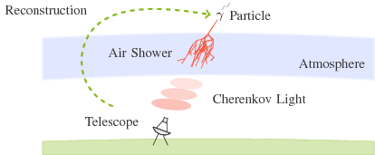

# CherenkovDeconvolution.jl

Deconvolution methods for Cherenkov astronomy and other use cases in experimental physics.

## Deconvolution in Cherenkov Astronomy

Obtaining the distribution of a physical quantity is a frequent objective in experimental physics.
In cases where the distribution of the relevant quantity cannot be accessed experimentally,
it has to be reconstructed from distributions of correlated quantities that are measured, instead.
This reconstruction is called *deconvolution*.

Cherenkov astronomy is a deconvolution use case which studies the energy distribution of cosmic gamma radiation
to reason about the characteristics of celestial objects emitting such radiation.
Since the gamma radiation is not directly measured by the ground-based telescopes employed in Cherenkov astronomy,
deconvolution is applied to reconstruct the gamma particle distribution from the related Cherenkov light recorded by these telescopes.

*A gamma particle interacting in Earth's atmosphere produces a cascade of secondary particles, the air shower. This shower emits Cherenkov light, which is measured by a telescope. The energy distribution of gamma particles can be reconstructed from IACT measurements.*

CherenkovDeconvolution.jl provides functions for reconstructing the distribution of a target quantity
from measurements of correlated quantities.

## Getting Started

Install the package by cloning this repository with the Julia package manager.

      Pkg.clone("git://github.com/mirkobunse/CherenkovDeconvolution.jl.git")

The [example directory](https://github.com/mirkobunse/CherenkovDeconvolution.jl/tree/master/example)
introduces the usage of CherenkovDeconvolution.jl.

## Current Status

CherenkovDeconvolution.jl implements an enhanced version of the Dortmund Spectrum Estimation Algorithm (DSEA+),
the Regularized Unfolding (RUN) method, and the Iterative Bayesian Unfolding (IBU).

We also ported this package to Python: [CherenkovDeconvolution.py](https://github.com/mirkobunse/CherenkovDeconvolution.py)

